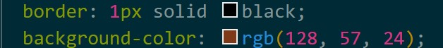
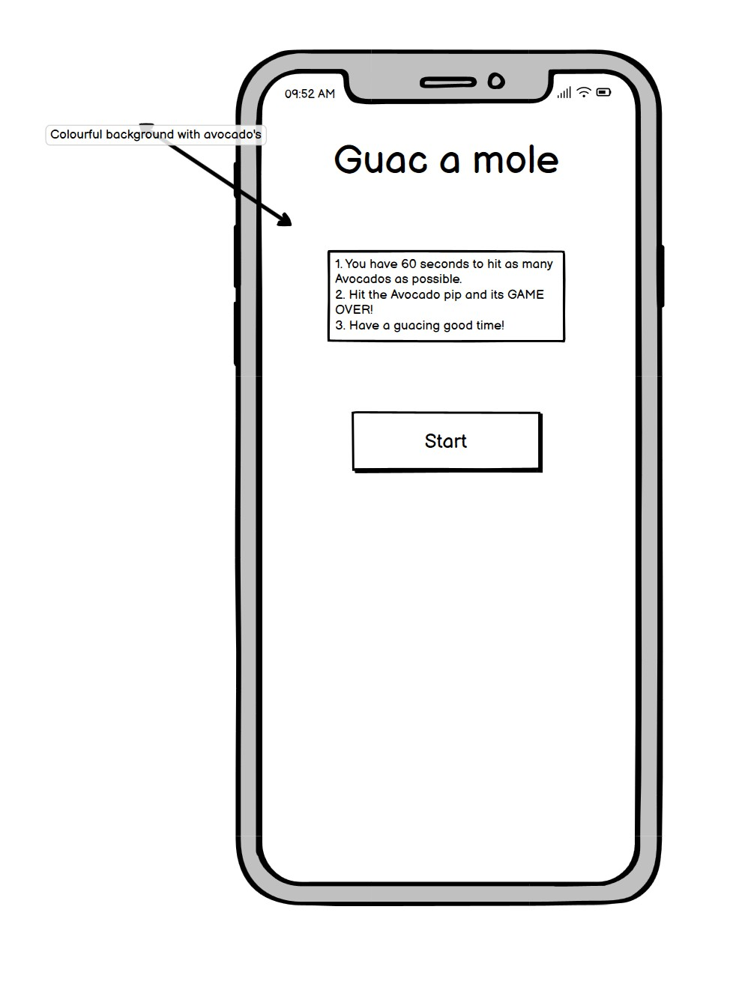
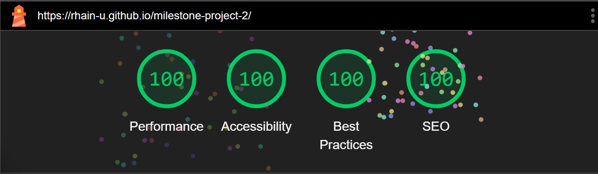

# Guac A Mole 

 

A fun Whack a mole game aimed at children between the ages of 6-10. 

 

[View the site from here.](https://rhain-u.github.io/milestone-project-2/) 

 

 

 

## 1. User Experience 

 

The purpose of this website is to provide a fun and interactive Whack a mole game where the user must hit the bad guacs to score points. Hit the good one and its Game over. 

 

The site is aimed at children ages 6-10 and its purpose is to help build on hand eye coordination. 

 

### 1.1 User Stories 

 

#### Client Goals 

 

- Ability to clearly understand the main aim of the game. 

- To be able to access this site on a range of different devices. 

- An easy-to-use game that is suitable children 6 and above as well as teenagers and adults. 

- Ability to clearly understand which mole to hit and know when it has been hit. 

 

#### Returning Client Goals 

 

- Bright and colourful display with a customised cursor. 

- Ability to restart the game. 

- Ability to provide feedback for further adaptations to the game. 

 

I have relied on these user stories to build the fundamentals of the game and keep on track of the end goals and to ensure that I have met all criteria. 

#### Returning Client Goals examples

## 2. Design 

 

### 2.1 Imagery 

 

For the background I chose an avocado themed background which I got from (https://pixabay.com/). I chose this as it is very colourful and enticing. 

 

for both the good mole and bad mole I used Microsoft AI Designer. (https://designer.microsoft.com/image-creator) 

 

### Fonts & Colour schemes 

 

 

 

 

 

The colour scheme applied has been selected based on the tones of the background image. I chose to darken the background image and select a bright vibrant yellow for the text, so it is easily readable and meets accessibility guidelines. I also tested this with friends and family members to get clear feedback. I have also run lighthouse tests on both mobile and desktop which came back almost 100%. 

 

### 2.3 Wireframes 

 

I used Balsamiq to create wireframes to help me visualize the layout of the site. Wireframes for mobile, tablet and desktop were created. 

 

 

 

 

 

 

 

 

 

 

 

 

## 3. Features 

 

The website consists of an index page with hidden pages within. The menu screen, game screen and results screen. Each will be shown once in turn once the start button has been clicked. I have also included a 404-error page. 

 

 

 

The User will land on the menu screen which will have the title of the game along with the rules of and start button. Once the start button is pressed it will take the user to the game screen where the timer will start to count down from 60 and stat with a score of 0. Every time the bad avocado is hit with the mallet a splatter sound will play, and a score will be added to the scoreboard. 

 

 

 

If the User clicks on the good mole, it will be game over and it will take them to the results screen where they can see their total score and a restart button which will take the user back to the homepage to play again. 

 

There will also be a form below the restart button where the user can provide feedback on the game. 

 

 

 

Lastly, I created a 404-error page with a button that will take the user back to the home screen if they land on it. 

 

 

 

I have applied a customer cursor which on click down rotates and click up returns upright mimicking a mallet hitting movement adding an extra element of fun to the game. I found this after watching a tutorial who I have credited below in the credit section. 

 

All of the pages other than that primary introductory section contain a restart button which navigate back to the very start. 

 

## 4. Technologies Used 

 

### 4.1 Languages Used 

 

- HTML 

- CSS 

- JavaScript 

 

### 4.2 Frameworks, Libraries & Programs Used 

 

- Balsamiq - to create wireframes 

- [GitHub](https://github.com/) - For version control and deployment 

- VS Code - used as the code editor and save files 

- [Google Fonts] (https://fonts.google.com/) - to implement the fonts used in the site 

- Chrome dev tools - To test and troubleshoot various features and test responsiveness of the pages. 

- [ChatGPT](https://chatgpt.com/) - to help identify and trouble shoot the format and wording of the JavaScript functions and help with some of the bugs I came across. 

- [JavaScript compiler] (https://pythontutor.com/javascript.html#mode=edit) - to test the JavaScript code and functions before applying to script.js. 

- [javascript.info] (https://javascript.info/dom-nodes) - to research further into JavaScript and how to apply. 

- [ Angle Brace YouTube tutorial to add the custom mallet cursor] (https://www.youtube.com/watch?v=b20YueeXwZg) - to learn how to implement this into my project. 

- [Pixillion image converter] (https://pixillion-free-image-converter.en.softonic.com/) - to convert images to different file types. 

- [Gimp](https://www.gimp.org/downloads/) - to edit my background image. 

- [Favicon.io] (https://favicon.io/emoji-favicons/) - to create an emoji favicon. 

- [Flat icon] (https://www.flaticon.com/) - to find and a mallat used as the cursor. 

- [Amiresponsive](https://ui.dev/amiresponsive) - to show the website on a range of device screens. 

 

## 5. Deployment & Local Development 

 

The website is deployed using GitHub Pages. To Deploy the site using GitHub Pages: 

 

1. Login (or signup) to GitHub. 

2. Go to the repository for this project - [Guac-A-Mole](https://github.com/rhain-u/milestone-project-2) 

3. Click the settings button. 

4. Select pages in the left-hand navigation menu. 

5. From the source dropdown select 'Deploy from a branch' and in the branch dropdown select 'main' and press save. 

6. The site has now been deployed. 

7. When returning to the code page in the repository a Deployments section will appear in the right-side column - this process may take a few minutes before the site goes live. The deployed sight can be accessed via this link. 

 

## 6. Testing and Bug Fixing 

 

### 6.1 Testing User Stories 

 

#### Client Goals 

 

#### Goal: - Ability to clearly understand the main aim of the game. 

 

Result - ✔ - The site is easy to use with clear title and rules of the game. 

##### Goal: - To be able to view the site on a range of devices. 

 
Result- ✔ - The site is responsive on several browsers and devices. (Some CSS is affected on Firefox browser.) 

 
 ##### Goal: - An easy-to-use game that is suitable children 6 and above as well as teenagers and adults. 

Result- ✔ - simple and clear format with bright colourful imagery texted on lighthouse to ensure it meets accessibility guidelines. 

 ##### Goal: - Ability to clearly understand which mole to hit and know when it has been hit. 

 Result- ✔ - Each of the moles are of a high image quality and have clear differences as one looks angry with lots of mud/ marks on and the good mole is happy with Smily face and clean. 

 

 

#### Returning Client Goals 

 

##### Goal: Bright and colourful display with a customised cursor. 

 

Result- ✔ - The site is very bright and enticing with colourful font in the hope that the user will want to return to play the game again and again. 

 

##### Goal: Ability to restart the quiz 

 

Result- ✔ - A clear and obvious restart button is visible on the results page giving the user the option to play again. 

##### Goal: - Ability to provide feedback for further adaptations to the game. 

 

Result- ✔ - There is a clear feedback section on the results page where the user can submit their thoughts on the game and what they would like to see added for future adaptions to the game. 

 

### 6.2 Accessibility 

 

Throughout this project my aim has been to keep this simple as possible so that it is easy to understand by all ages and disabilities. 

 

I chose to use GIMP to darken the background so that the font is much more visible and clearer. 

 

I have also used the chrome extension Web Disability Simulator to also consider the visuals of the page and contrast between the content for users with visual impairments. 

 

A google font has been used on the site however I have also applied Sans-Serif as a font alternative. 

 

Finally, as displayed in the Lighthouse testing in section 6.5 below, the scores of accessibilities are at 100% on all pages of the site. 

 

### 6.3 Fixing Bugs 

 

I came across multiple bugs whilst creating this project and managed to fix them all. 

 

#### 2 moles occupied the same hole. 

 

Once I had built the game functions, I soon realised that the game would end randomly even when the correct mole had been hit. 

 

Firstly, I check dev tools and realised that both moles were randomly occupying the same hole every few movements which would explain the game suddenly ending as both are being clicked at the same time. I did some research into this on Stack overflow and W3 Schools and Slack but had no luck in fixing the issue at hand. 

 

Secondly I used Chat GPT to try and resolve the issue but again no luck. Lastly I got in touch with tutor support who after some time working on it together realised that if a while loop was implemented on both the good and bad mole it would fix the issue at hand. 

 

I implemented the advised changes and this fixed the bug. 

 

 

 

#### Prettier bug 

 

Whilst this bug wasn't the biggest bug to fix it was one of the most frustrating by far. I realised that whenever I tried to format my HTML the prettier symbol in the bottom right would flash red. This was due to a Syntax error and advised that there was an unexpected closing tag. 

 

Resolution - I realised that the closing div to my wrapper div was missing. I replaced this and that fixed the bug. 

 

 

 

#### Cursor disappearance 

 

I came across this bug whilst in the final stages of testing. The cursor would only appear on the edges of each screen and the results screen making it impossible to play the game as the user would not know where the cursor is. I used dev tools to identify the issue and used ChatGPT for reasons why this issue may arise which led me to the answer very quickly. 

 

This turned out to be quite a simple fix and was due to the cursor div in my index.html file being outside the wrapper div which all my other data was inside of. I moved it to the top within the wrapper div which solved the issue. 

 

#### Restart button appearing on the game screen which would cause the game occasionally to end. 

 

I was running through checks on the deployed site when I came across a bug where the restart button would appear mid game which would cause the game to end. 

 

I did some research on Stack overflow to see if anyone else had experienced anything like this before as well as dev tools to try to identify why this has suddenly started happening. I soon found out that it was because I had a style display as none on the game page when in fact it should have been none. I made the changes in dev tools to begin with which worked, so then applied in vs code. This resolved the issue. 

 

 

 

 

### 6.4 Manual Testing 

 

Full testing has been completed on the following devices: 

 

- Laptop: Lenovo Ideapad 3 

- Mobile: Google pixel 9 

 

The browsers used to test the site include: 

 

- Google Chrome 

- Microsoft Edge 

- Mozilla Firefox (Some CSS differences. did not work properly on this browser.) 

 

#### My understanding of TDD (Test driven development) 

 

- Test Driven Development (TDD) is a software development approach where you write tests before you write the actual code. It follows a simple cycle often summarized as Red-Green-Refactor. 

 

#### The TDD Cycle: 

 

- Red – Write a test for a new function or feature. It should fail at first because the functionality doesn't exist yet. 

 

- Green – Write the minimum amount of code necessary to make the test pass. 

 

- Refactor – Clean up the code while making sure the test still passes. 

 

#### My understanding of BDD (Behaviour Driven development) 

 

- BDD is like an evolution of TDD, but it focuses more on the behaviour of the system from the user’s perspective. Instead of writing tests about the code, you describe how the application should behave using plain language that's easy for developers, testers, and non-technical team members to understand. 

 

#### My Approach. 

 

- I used more of a BDD approach, writing small batches of code that buildd off my user stories and tested to ensure it worked before complicating it too much, especially when it came to writing JavaScript. I Used JavaScript compiler to get the basic functions correct first then with the help of stack overflow, Slack, Chat GPT and Copilot I would build on them to create the functions I needed. 

 

- I also tested the game out on family members and friends to get their feedback which was all positive. 

 

### 6.5 Lighthouse 

 

Please see below screenshots for both Mobile and Desktop. 

 

Mobile 

 

 

Desktop 

 

 

The main issues identified across the site were in relation to Bootstrap which I didn't know how to fix or if that is something I could in fact change.  

 

 

### 6.6 Validation 

 

#### 6.6.1 W3C HTML and CSS 

 

[W3C] (https://validator.w3.org/) validator has been used to check the HTML on each of the pages of the website and the CSS stylesheet. 

 

##### HTML - [index.html] (index.html) 

 

 

 

The initial check highlighted a few issues with the code.  

 

These issues have now been addressed and all the html code on the homepage has successfully passed the html validation. 

 

##### HTML - [404.html] (404.html) 

 

 

 

The initial check highlighted a few issues with the code.  

 

These issues have now been addressed and all of the html code on the homepage has successfully passed the html validation. 

 

 

##### CSS Stylesheet 

 

I used [W3C CSS Validator](https://jigsaw.w3.org/css-validator/) to sense check all CSS code before submitting 

 

##### CSS - [style.css] (style.css) 

 

 

 

 

#### 6.6.3 JS jsHint 

 

The JavaScript code has been validated through [JsHint](https://jshint.com/).  

 

 

 

I had a 1 warning which was to add /* jsHint eversion: 6 */ to the top of my stylesheet. 

 

## 7. Credits 

 

### 7.1 Code Used 

 

- [YouTube tutorial to add mallet with JavaScript and to make it rotate with CSS.](https://www.youtube.com/watch?v=b20YueeXwZg) - referred to in 4.2 

-  

 

### 7.2 Content 

 

- [chatgpt.com] (https://chatgpt.com/)- referred to in 4.2 

 

### 7.3 Media 

 

- [Favicon.io] (https://favicon.io/emoji-favicons/) - referred to in 4.2 

- [Pixillion Image Converter] (https://www.nchsoftware.com/imageconverter/download-now.html) - referred to in 4.2 

- [GIMP](https://www.gimp.org/downloads/) - referred to in 4.2 

- [Free sound] (https://freesound.org/people/gprosser/sounds/361030/) - the artist - gprosser 

- [Canva] (https://www.canva.com/) 

- [FlatIcon] (https://www.flaticon.com/) 

- [Pixibily] (https://pixabay.com/illustrations/background-avocado-pattern-green-5580015/) 

- [Google Fonts] (https://fonts.google.com/specimen/Flavors) - Used to select and implement fonts for the website. 

 

 

### 7.4 Documentation and Testing 

 

I have used the following sources to help guide and structure the documentation of this project. 

 

- [JavaScript compiler] (https://pythontutor.com/javascript.html#mode=edit) - to test the JavaScript code and functions before applying to script.js 

- [chatgpt.com] (https://chatgpt.com/) 

- [Diffchecker](https://www.diffchecker.com/) 

- [W3C] (https://validator.w3.org/) 

- [Web AIM] (https://webaim.org/resources/contrastchecker/) - consider the accessibility and contrast. 

- [Web disability simulator] (Google browser extension) - This allows you to view what your website would look like with different visual imparements.  

- [Amiresponsive](https://ui.dev/amiresponsive) - to show the website on a range of device screens 

 

### 7.5 Acknowledgements 

 

I would like to thank everyone who has helped me throughout this project. 

 

- Spencer my mentor who has been great throughout the course so far. 

- Rachel my tutor who has been a great help with weekly drop-in sessions to keep me in check and on schedule. 

- Students on the Slack channels when I have needed help with certain issues. 

 

 

 

 

 